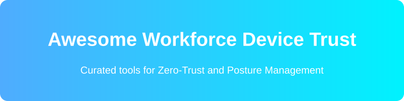

  

<meta name="description" content="A curated list of awesome workforce device trust platforms, zero-trust endpoint security solutions, open-source MDM tools, and posture management frameworks.">
<meta name="keywords" content="device trust, zero trust, MDM, osquery, endpoint security, conditional access, fleetdm, kolide">

# Awesome Workforce Device Trust Platforms

    

**Workforce Device Trust Platforms** continuously assess the security posture and compliance of employee devices (laptops, mobiles, etc.) and use that signal for zero-trust access decisions, conditional access, and endpoint management. Leading commercial solutions include Kolide, Kandji, JumpCloud Device Trust, Microsoft Intune, Cisco Duo Device Trust, Jamf Protect, Workspace ONE, Uptycs Device Trust, Tanium, and Scalefusion.

Below is a **curated list** of notable platforms and their open-source equivalents. The open-source ecosystem is particularly strong in this space thanks to osquery-based visibility and modern open MDM platforms.

## 🏢 SaaS / Hosted Platforms

| Product | Description | Pricing | Free Tier Limit |
|---|---|---|---|
| **[Kolide](https://www.kolide.com/)** | Device trust and compliance platform focused on user-friendly posture checks and remediation guidance (especially strong on macOS/Linux visibility). | ~$6/device/month | No free tier |
| **[Kandji](https://www.kandji.io/)** | Modern Apple-focused device management and security platform. | Custom Pricing | No free tier |
| **[JumpCloud Device Trust](https://jumpcloud.com/)** | Enterprise device management, endpoint security, and device-trust / conditional-access solutions. | Custom Pricing | No free tier (legacy: 10 users/devices) |
| **[Microsoft Intune](https://www.microsoft.com/en-us/security/business/microsoft-intune)** | Enterprise device management, endpoint security, and device-trust / conditional-access solutions. | ~$8/user/month (Included in M365) | No free tier |
| **[Cisco Duo Device Trust](https://duo.com/)** | Enterprise device management, endpoint security, and device-trust / conditional-access solutions. | ~$3 - $9/user/month | Up to 10 users |
| **[Jamf Protect](https://www.jamf.com/)** | Enterprise device management, endpoint security, and device-trust / conditional-access solutions. | Custom Pricing | No free tier |
| **[Workspace ONE](https://www.omnissa.com/)** | Enterprise device management, endpoint security, and device-trust / conditional-access solutions. | Custom Pricing | No free tier |
| **[Uptycs](https://www.uptycs.com/)** | Enterprise device management, endpoint security, and device-trust / conditional-access solutions. | Custom Pricing | No free tier |
| **[Tanium](https://www.tanium.com/)** | Enterprise device management, endpoint security, and device-trust / conditional-access solutions. | Custom Pricing | No free tier |
| **[Scalefusion](https://scalefusion.com/)** | Enterprise device management, endpoint security, and device-trust / conditional-access solutions. | ~$2 - $4/device/month | 14-day free trial only |

## 🔓 Open-Source Software

### 🌟 Leading Open-Source Device Management & Posture
- **[osquery](https://github.com/osquery/osquery)**  — Foundational open-source endpoint instrumentation framework that exposes operating-system data as a high-performance relational database. Powers Fleet and many commercial device-trust solutions; excellent for custom posture queries and compliance checks.
- **[Fleet](https://github.com/fleetdm/fleet)**  (FleetDM) — The premier open-source device management and device-trust platform. Built on osquery, it provides real-time visibility, policy enforcement, vulnerability detection, MDM capabilities (macOS, Windows, Linux, and more), GitOps workflows, and strong support for zero-trust posture assessment. Self-hostable and highly transparent.

### Additional Open-Source MDM / Endpoint Tools
- **[MeshCentral](https://github.com/Ylianst/MeshCentral)**  — Open-source RMM (Remote Monitoring and Management) platform that provides visibility, scripting, and remote management capabilities useful in device-trust workflows.
- **[TacticalRMM](https://github.com/amidaware/tacticalrmm)**  — Remote Monitoring and Management tool built with Django and Vue, useful for managing and monitoring endpoints.
- Emerging and community open-source MDM projects that support multi-platform enrollment, configuration profiles, and basic device management (including projects aiming for full multi-OS coverage).

### Zero-Trust Access with Device Posture
- **[Teleport](https://github.com/gravitational/teleport)**  — Open-source zero-trust access tool that can incorporate device posture checks as part of access decisions.
- **[Open Policy Agent](https://github.com/open-policy-agent/opa)**  — General-purpose policy engine that can evaluate device signals alongside identity for fine-grained authorization.
- **[Pomerium](https://github.com/pomerium/pomerium)**  — Identity-aware proxy and zero-trust gateway.
- **[OpenZiti](https://github.com/openziti/ziti)**  — Zero-trust network overlay and application embedded network for secure access.

### 🛠️ Typical Open-Source Approach
1. **Visibility & telemetry** — osquery agents collecting rich endpoint data
2. **Control plane** — Fleet for querying, policy, MDM actions, and compliance reporting
3. **Access enforcement** — Integrate posture results into an identity-aware proxy or zero-trust gateway (Teleport, Pomerium, etc.)
4. **Remediation** — Scripts, profiles, and GitOps-driven configuration management
5. **Reporting & audit** — Export to SIEM or data lake for continuous monitoring

This stack delivers transparent, auditable device trust without proprietary agent lock-in and works across mixed OS fleets.

---

**How to contribute**  
Fork this repository, add a new project (with link + short description + category), and open a pull request.  
Prefer actively maintained open-source projects related to device trust, endpoint posture, MDM, osquery management, or zero-trust device assessment.

**License**  
This list is public domain / CC0. Feel free to copy into your own awesome list or README.

Star the projects you find useful — open device-trust tools help organizations verify endpoints without black boxes! 🔐

##  Star History

<a href="https://www.star-history.com/?repos=ishandutta2007%2FAwesome-Workforce-Device-Trust&type=date&legend=bottom-right">
<picture>
<source media="(prefers-color-scheme: dark)" srcset="https://api.star-history.com/chart?repos=ishandutta2007/Awesome-Workforce-Device-Trust&type=date&theme=dark&legend=bottom-right" />
<source media="(prefers-color-scheme: light)" srcset="https://api.star-history.com/chart?repos=ishandutta2007/Awesome-Workforce-Device-Trust&type=date&legend=bottom-right" />

</picture>
</a>

